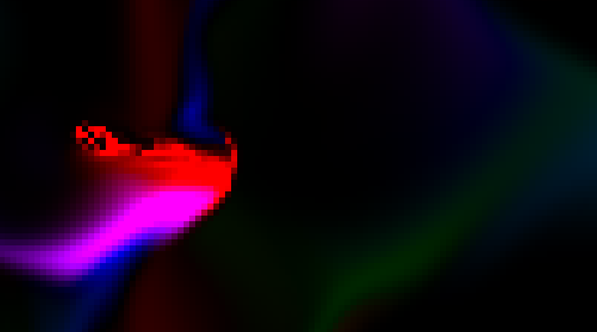

# Fluid Simulation in Rust

## Types of Fluid Sim
There are two main types of fluid simulations, there are [Eulerian Fluid Simulators](https://en.wikipedia.org/wiki/Euler_equations_(fluid_dynamics)) and [Smoothed Particle Hydrodynamics Fluid Simulators](https://en.wikipedia.org/wiki/Smoothed-particle_hydrodynamics). Each are competitive adn have their own pros and cons is approximating fluid behavior.

### Eulerian Fluid Simulators
These simulations work on a grid of cells, each holding a velocity vector representing the direction of the fluids motion. Through iterative equations on the grid you can approximate a fluids motion. This form of fluid simulation lacks the ability to interact with air or other particles, unlike the alternative. But, it is the quickest requiring simple vector operations over a fixed size grid. 
### Smoothed Particle Hydrodynamics Fluid Simulators
Particle simulations use real particles containing velocity and their position. Each particle interacts with one another very much like particles in fluids. These simulations can be run on a multi core system but the performance cost of scaling a simulation is much greater than a conventional gird system. This method however is able to interact with other particles such as air and may be more accurate in many cases.

## The Project
I will be showing how to create a [Eulerian Fluid Simulators](https://en.wikipedia.org/wiki/Euler_equations_(fluid_dynamics)). 
There are three main components to a fluid. 

> **Advection**\
> The movement of particles in their direction of travel

> **Diffusion**\
> The spread of particles taking on the average velocities in region

> **Removal of Divergence (Projection)**\
> Removal of regions where their is more inflow than out flow and regions where there is more outflow than inflow

These three rules are crucial to the behavior of a fluid. 

## Sources
 - https://matthias-research.github.io/pages/tenMinutePhysics/17-fluidSim.pdf
 - https://www.mikeash.com/pyblog/fluid-simulation-for-dummies.html
 - Wikipedia: Euler_equations_(fluid_dynamics) https://en.wikipedia.org/wiki/Euler_equations_(fluid_dynamics)
 - Wikipedia: Smoothed-particle_hydrodynamics https://en.wikipedia.org/wiki/Smoothed-particle_hydrodynamics
 